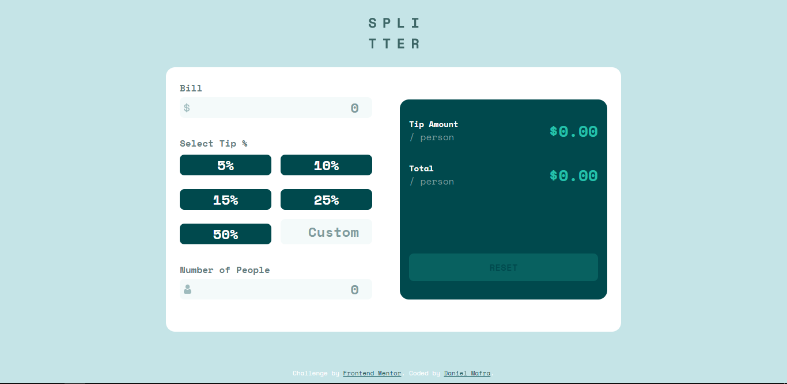

# Frontend Mentor - Tip calculator app solution

This is a solution to the [Tip calculator app challenge on Frontend Mentor](https://www.frontendmentor.io/challenges/tip-calculator-app-ugJNGbJUX). Frontend Mentor challenges help you improve your coding skills by building realistic projects.

## Table of contents

- [Overview](#overview)
  - [The challenge](#the-challenge)
  - [Screenshot](#screenshot)
  - [Links](#links)
- [My process](#my-process)
  - [Built with](#built-with)
  - [What I learned](#what-i-learned)
- [Author](#author)
- [How to use the project](#how-to-use-the-project)

## Overview

### The challenge

Users should be able to:

- View the optimal layout for the app depending on their device's screen size
- See hover states for all interactive elements on the page
- Calculate the correct tip and total cost of the bill per person

### Screenshot

### Links

- Solution URL: [Github Repository](https://github.com/DanielMafra/tip-calculator-app)
- Live Site URL: [Live Demo](https://danielmafra.github.io/tip-calculator-app)

## My process

### Built with

- Semantic HTML5 markup
- CSS custom properties
- Flexbox
- CSS Grid
- Mobile-first workflow
- [React](https://reactjs.org/) - JS library

### What I learned

With this challenge, I managed to establish some knowledge, such as controlling the state of the interface and also developing the logic to make the calculations.

## Author

- Website - [Daniel Mafra](https://danielmafra.github.io)
- Frontend Mentor - [@danielmafra](https://www.frontendmentor.io/profile/DanielMafra)
- LinkedIn - [@danielmafradev](https://linkedin.com/in/danielmafradev)
- Instagram - [@danielmafradev](https://instagram.com/danielmafradev)

## How to use the project

Clone the repository using "git clone". After that use the command "npm install" or "yarn install" to install the dependencies, finally use the command "npm start" or "yarn start" to open the project in the browser.
